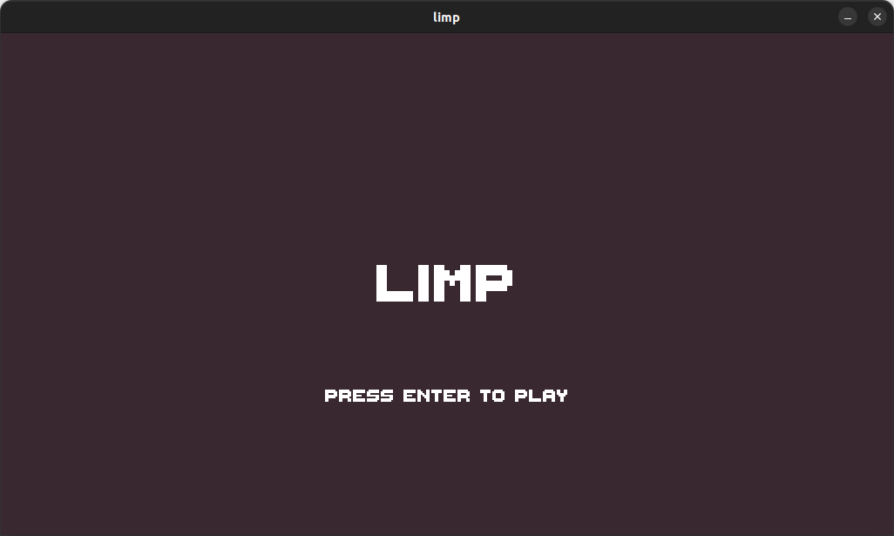
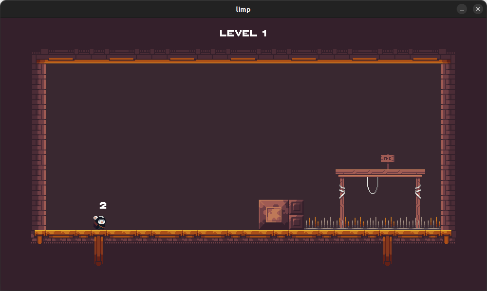
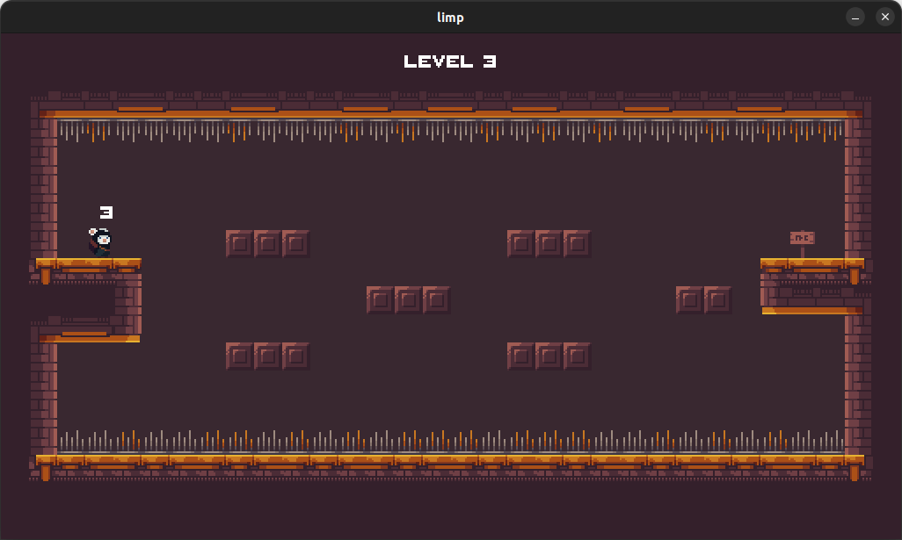

<h1 align = 'center'>LIMP</h1> 
<p style='text-align: justify'><b>Limp</b> is a puzzle platformer game. This game is made with python, pygame and pytmx frameworks and Tiled map editor. The concept of the game is The player character to reach the end of level with limited jumps.</p>


### 🖼️ SCREENSHOTS
 

 




## 🕹️ How to run
> Before run the project check if you are already install python3, [pygame](https://www.pygame.org/wiki/GettingStarted) and [pytmx](https://github.com/bitcraft/pytmx#installation) in your PC.
- Unzip the project
- Open the project folder in terminal
- Then run
```
python main.py
```


## 🎮 CONTROLS
Movements | Keys
----------|---------
Jump      | ⬆️ or 🆆
Left      | ⬅️ or 🅰
Right     | ➡️ or 🅳 


## 📜 CREDITS
### FONT 🔠 
- [ThaleahFat by TinyWorlds](https://tinyworlds.itch.io/free-pixel-font-thaleah)

### SFX & MUSIC 🎵 
- [Pixabay music](https://pixabay.com/music/)
- [AntipodeanWriter](https://pixabay.com/music//?utm_source=link-attribution&amp;utm_medium=referral&amp;utm_campaign=music&amp;utm_content=15480)
- [Didigameboy](https://didigameboy.itch.io/jambo-jungle-free-sprites-asset-pack)

### PIXEL ART 👾 
- [Anokolisa](https://anokolisa.itch.io/)
- [Penusbmic](https://penusbmic.itch.io/)
- [Bdragon1727](https://bdragon1727.itch.io/)


## 📝 LICENSE
Limp is free and open-source game licensed under the [MIT](./LICENSE). 